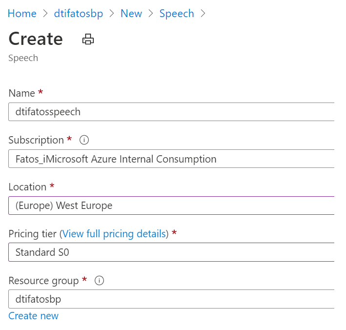
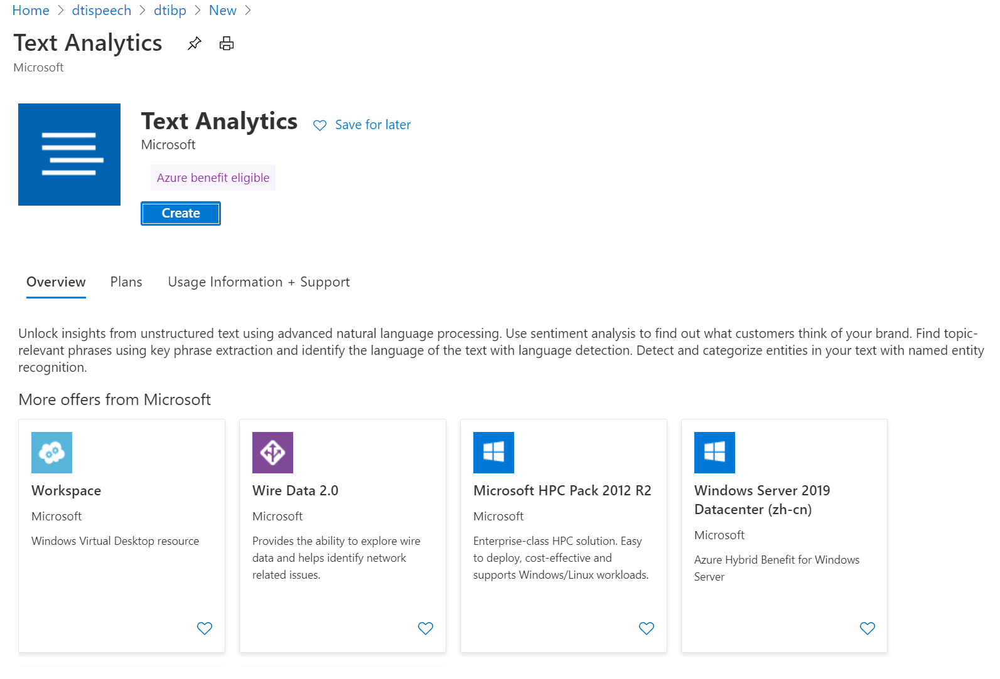
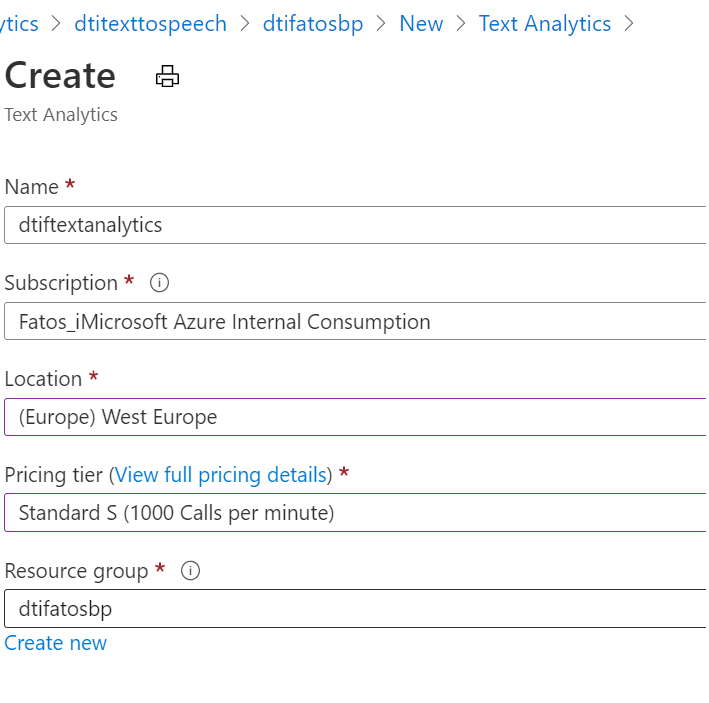
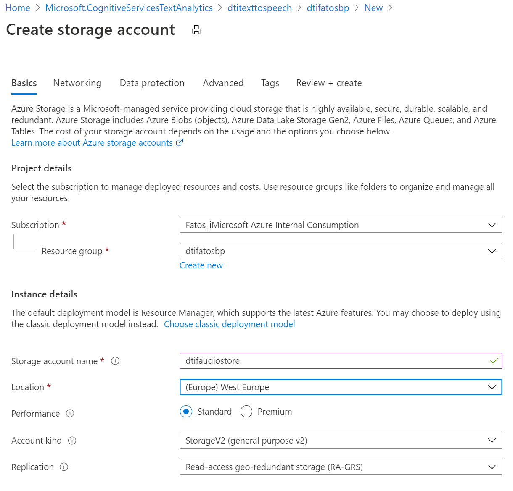
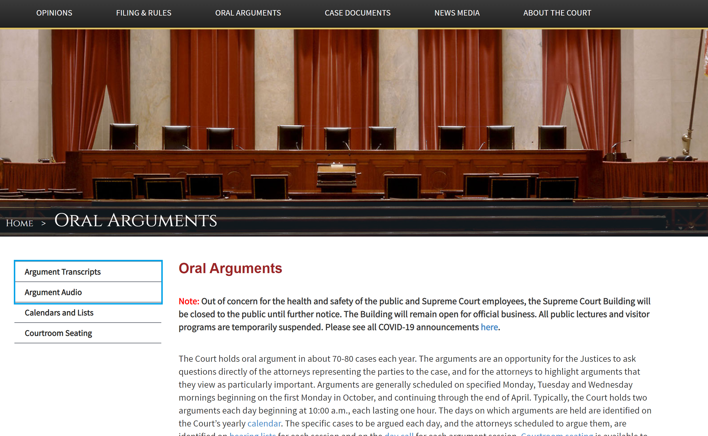
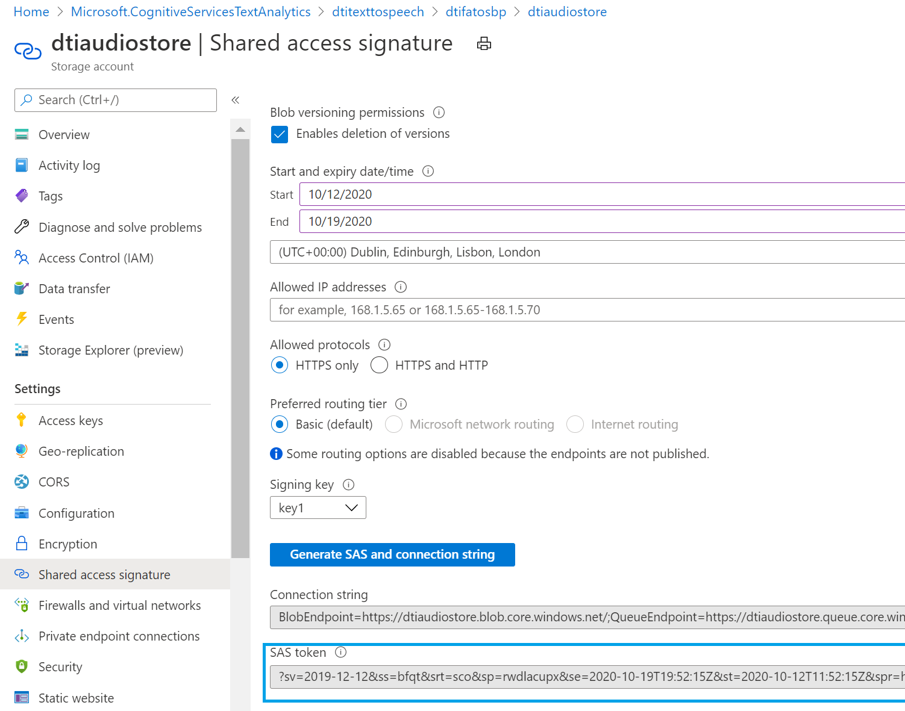

# Azure Speech Services Hands on Lab

In this Hands on Lab you will process Speech using Azure Cognitive Services through a step by step practical tutorial. 

You will get to practice with the following cognitive services features:
- Speech to Text
- Text to Speech
- Machine Translation

By the end of this hands on lab, you would have created a Speech cognitive service and used it to:
- transcribe audio files using a baseline Speech to Text model
- extract sentiment scores for each utterance in the transcription
- convert text to speech using standard and neural voices provided by Microsoft
- Detect and translate audio content from files and the microphone
- Visualize sentiment trend of an audio call in PowerBI

You will use the Speech cognitive services SDK and REST API and will develop all of the above in Python.

## Prerequisites

> It's important to ensure all of the following prerequisites are met:-

1. An Azure subscription
1. Speech to Text service (Azure: *Speech*)
1. Text Analytics service (Azure: *Text Analytics*)
1. Python version between 3.5 and 3.8 inclusive
1. Jupyter Notebook
1. pip install azure-cognitiveservices-speech
1. pip install PyPDF2
1. pip install azure-storage-blob
1. [ffmpeg](https://www.gyan.dev/ffmpeg/builds/ffmpeg-release-full.7z) 
1. [On Windows only] - [Microsoft Visual C++ Redistributable for Visual Studio 2019](https://support.microsoft.com/help/2977003/the-latest-supported-visual-c-downloads)

Follow the instruction at the following [link to setup](https://docs.microsoft.com/en-us/azure/cognitive-services/speech-service/quickstarts/setup-platform?tabs=dotnet%2Clinux%2Cjre%2Cbrowser&pivots=programming-language-python) the Speech SDK for Python.

## 1. Overview of the Speech to Text
The Azure Speech to Text service is part of the Azure Cognitive Services that gives  you the capabilitiy to leverage cutting edge and world leading speech to text technology to transcribe audio content in batch or real time. To use Speech to Text you will need to create a Speech to Text service which gives you an endpoint that you can call by issuing a POST request with an audio file or interface with it using the SDK to generate a transcription. In addition to the Speech to Text endpoint, Microsoft also provide [Speech Studio](https://speech.microsoft.com/portal/) which allows you to: 

- Test baseline models for both Speech to Text (STT) 
- Build and train custom Speech to Text models
- Compare STT models visually using WER (Word Error Rate)
- Train models using Acoustic and Language Adapation techniques
- Deploy custom model endpoints

When you create a Speech service in Azure, the service can be leveraged for Speech to Text, Text to Speech, or Speech Translation.

## Let's begin!

### 1. Building our Speech to Text transcriber

  We will now create our Speech to Text service and transcribe a sample audio file using the REST API. 

  1. Log in to Azure Portal 
  2. Click on **Create a Resource** > search for **Speech** > select **Speech** > Click on **Create**
   
       
  1. On the next screen set the Speech to Text basic configuration settings like below:
   

  1. After hitting **Create** the Speech to Text service will be provisioned. Next you will create a Text Analytics service. To do that, go to the Azure Portal home page and search for **Text Analytics**. Select **Text Analytics** and carry out the following steps:
   

  1. Configure the basic settings of your Text Analytics service like in my example and hit **Create**
    

  1. Now that we have both of our Cognitive Service provisioned, we will proceed to create a storage account where we will store our audio files and where the transcriptions will be stored as well. From the Azure Portal home page, clikc on **Storage Accounts** and create a storage account with a basic configuration as follows:
   
   Once you provision the storage account, you're going to upload some data in there but before you do that you need first create a container in the storage account. To do that carry out the following steps:
      - Click on the storage account resource you created and from the left click on **Overview**
      - Click on **Containers**
      - Click on **+ Container**
      - Enter a name for the container (e.g. inputaudio)
      - Click **Create**
  1. Download and install **ffmpeg** 
     **[For Windows users]**
     - Download ffmpeg from https://www.gyan.dev/ffmpeg/builds/ffmpeg-release-full.7z
     - You will need 7zip to uncompress this file. If you don't haven 7zip installed, download and install from https://www.7-zip.org/download.html
     - Uncompress the ffmpeg .7z file in a folder of your choice. 
     - From Windows Explorer, right click on **This PC** and select **Properties**
     
     - Next, click on **Advanced system settings**
     - Then click on **Envrionment Variables**
     - In System Variables find the **Path** variable and add a new entry pointing to the full path of the **ffmpeg-4.3.1-2020-10-01-full_build\bin** directory
     - Launch a new command prompt and enterr **ffmpeg** to verify that ffmpeg is recognized by the Windows command prompt.

  1. We have now provisioned all the Azure services that we need for this Hands on Lab. The scenario that we will work together with is to do with the US Supreme Court hearings which luckily for us has a website with all the Argument audio files and associated transcripts to download and use for free. 
  
  The audio files of each oral argument are quite lengthy - in most cases more than an hour in length of audio recording. The assoiated transcript comes in PDF format so that can introduce some challenges to how we process this data. The exercise that we will undertake in this hands on lab is the following:

      - Download an audio file (in mp3 format) and its associated transcript file from the US Supreme Court website 
      - Split this mp3 file into smaller mp3 files
      - Convert these smaller mp3 files in .wav files with 16000 Hz encoding as required by the data preparation steps as outlined in: https://docs.microsoft.com/en-us/azure/cognitive-services/speech-service/how-to-custom-speech-test-and-train
      - Associate each generated .wav file with a corresponding transcription (manual step) and save the transcripts in a .txt file. We're going to use this dataset when we create a custom model in the Challenger exercise for this week. We can also use this dataset to **Test** our custom models and compare them with the baseline models. 
      - Upload a small set of audio files to the Storage Account in a storage container you created earlier
      - Go through the SpeechToText.ipynb Jupyter Notebook to do batch transcription of a number of audio files (.wav) uploaded in storage container
      - In the SpeechtoText.ipynb Jupyter Notebook yo uwill also extract the sentiment of the utterances within the audio file. As you will notice most of the utterances will be classified as Neutral because of the nature of the US Supreme Court dataset which largely consists of factual statements

### Let's transcribe
  1.  Browse to the US Supreme Court website and pick on Oral Argument (e.g. https://www.supremecourt.gov/oral_arguments/audio/2020/19-309) 
   Download both the mp3 file and the PDF transcript.
  2. Open command prompt and cd into the directory where you downloaded the mp3 file. Enter the ffmpeg command as follows to split the mp3 file into multiple smaller mp3 files:
    - ffmpeg -i  "19-309.mp3" -f segment -segment_time 50 -c copy 19-309out%03d.wav
  3. Convert the smaller mp3 file into .wav files with 16000 Hz encoding:
    - for f in *.mp3; do ffmpeg -i "$f" -acodec pcm_s16le -ac 1 -ar  16000 "${f%.mp3}.wav"; done
  4. Open each generated .wav file and manually transcribe the file to create the training set (a subset of which we will use to test our custom models). There is an existing dataset that has been split and converted and associated with transcriptions in the Github repo so you don't have to do this step manually. Study the structure of the .wav file and the transcripts.txt file to see how we've prepared the data.
  5. Take a few .wav files that you generated in step 3 and upload them into the storage container you created earlier. You can upload files to the storage container through the **Azure Portal** or through **Azure Storage Explorer**. If you prefer a command line interface then you can do the same using commandline utitlies such as **Azure CLI** and **AzCopy**.
  6. Download the **SpeechToText.ipynb** file to your local machine (you can also clone the entire git repo)
  7. Launch **Jupyter Notebook** (ideally from the location where the SpeechToText.ipynb file resides or any of its parent folders)
  8. In the Jupyter Notebook, study each cell so that you gain a firm understanding of how we leverage the Speech to Text REST API to perform batch transcription of audio files stored in a storage container. 
     - Change the **region** variable and the **SUBSCRIPTION_KEY** variable to point to the region where you created your Speech to Text service and the SUBSCRIPTION_KEY that your Speech to Text services uses respectively. To find the SUBSCRIPTION_KEY, go to your Speech to Text service and from the left click on **Keys and Endpoint**. 
     **Key 1** is the Speech to Text key that you need to substitute in the **SUBSCRIPTION_KEY** variable.
     - Next we need to use to more variables used for access the storage account from Python, namely the Storage acccount connection string and a generated SAS token. To obtain both of these go to Azure Portal and clikc on the Storage Account you created earlier.
     For connection string, click on **Access Keys** from the left and copy the **Connection string** value.
     For SAS token, click on **Shared access signature** from the left and select the checkboxes (Service, Container, and Object). Change the End data to a date in the future (e.g. a week from now)and click on **Generate SAS and connection string**
     
     Substitute both values in the **connect_str** and **SAS** variables in the Jupyter Notebook.
     Make sure the **container_name** and **account_name** variables have the correct values. 

  7. Once all transcriptions have succceeded, the transcriptions are saved locally in JSON format. You can of course save them back to a storage container in an Azure storage account. **[This is left of the reader to complete]**

## 2. Overview of Text to Speech

The Speech to Text service we created earlier can be also used for Text to Speech tasks. In this part of the Hands on Lab we will go through a simple exercise of converting a piece of text into a machine generated speech. Some of the core features of Text to Speech include
  - Speech synthesis using Speech SKD or REST API to convert text to speech using standard, neural, or custom voices
  - Asynchronous synthesis of long audio files, more than 10 minutes
  - Standard voices - highly intelligible and natural sounding voices created using parametric synthesis techniques. Your application can speak in 45 languages and variety of voice ranges.
  - Neural voices - Created using deep neural networks which overcome some of the traditional limitation of traditional methods in speech synthesis. The speech generated using neural voices is more natural and more engaging. 
  - Speech Synthesis Markup Language (SSML) - an XML based markup language to customize text to speech outputs. For instance, you can customize and adjust pitch, add pauses, improve pronounciation, speed up or slow down speaking rate, and many more. 

In this part of the Hands On Lab you will experiment with Text to Speech and experience how you can generate speech from text input and control the inotation, speed, gender, standard or neural voices add even multiple voices in one generated speech.

 1. Download the **TextToSpeech.ipynb** Jupyter Notebook in your local machine
 2. Substitute the **speech_key** and **service_region** variables with your Speech to Text Key and region where you provisioned the Speech service. 
 3. Run through the cells
 4. Notice how we're leveraging the Speech Synthesis Markup Language (SSML) to define and customize our speech

 Do try different standard and neural voice by going to: https://docs.microsoft.com/en-us/azure/cognitive-services/speech-service/language-support#neural-voices
 
 Also try to customized your generated speech using SSML. Practice the example provided here: https://docs.microsoft.com/en-us/azure/cognitive-services/speech-service/speech-synthesis-markup?tabs=python
 

## 3. Overview of Speech Translation

Microsoft's Speech Translation service is powered by a fast and reliable neural machine translation technology. Using Speech Translation you can translate from more then 30 languages and customise your translations for your organisation's specific terms. Like with other Cognitive Services, you can use Speech Translations through you favorite programming language C#, Javascript, Python, REST, etc. 

In this Hands On Lab you will get to work with a Jupyter Notebook that takes you through a simple exercise of transcribing speech in real time using your microsophone and translating the speech in a chosen language. 

1. Download the **SpeechTranslate.ipnyb** Jupyter Notebook and go through the cells to practice machine translation using Microsoft Azure Cognitive Services
2. As you may have noticed by now, we are using the same cognitive service (Speech Service) we created in the first part of the Hands on Lab. 
3. Substitute the **speech_key** and **service_region** for your own Speech Service key and region.
4. When you execute the following cell: *result = speech_recognizer.recognize_once()* you will be asked to say something to your microphone. The next cell then will show the transcribed text from your speech. 
5. The next few cells are some useful functions that you should study and understand the logic behind them. 
6. The last function synthesizes the translated speech and plays the result so you can hear your speech in a different language using a neural or standard voice. 
7. You can change the **to_language** variable to 'de' for German, or 'it' for Italian or 'fr' for French to translate your spoken sentence to another language. 
8. By changing the uncommenting the line *audio_config = speechsdk.audio.AudioConfig....* you can specify a .wav file which you can translate in batch.

### 4 Final Wrap Up

You have successfully created your own Speech service, congrats! You have successfully generated text from Audio files and from your microphone, brought life to text in the form of neural voices, and translated your spoken words into multiple languages. I look forward to seeing how you will apply these learnings to your use case.

This guide will stay publicly available, so if you wish to create a demo for internal or external meetings, you can do so by performing the steps within your Azure Subscription.

